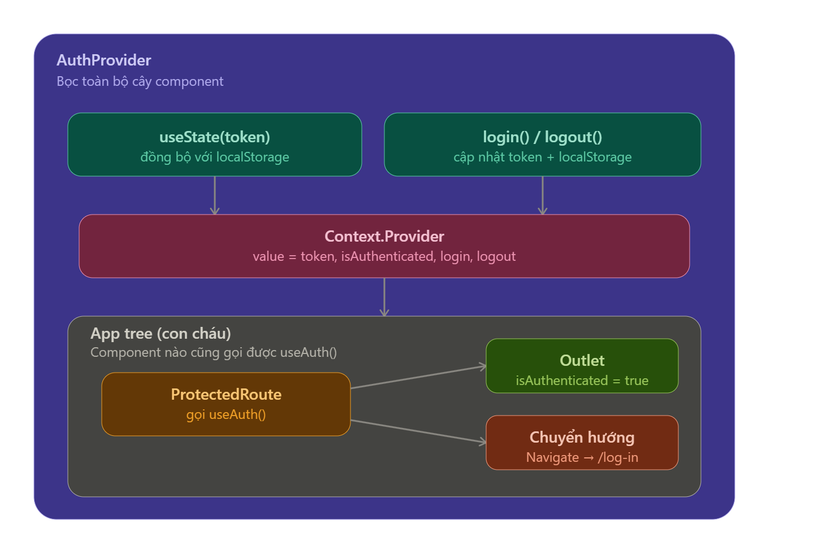

## Đọc lại AuthContext — từng mảnh ghép

Trước tiên, hình dung bằng sơ đồ luồng dữ liệu:


**1. `createContext()` — tạo "cái hộp" rỗng**

```js
const AuthContext = createContext();
```

Đây chỉ là khai báo một "kênh truyền" chưa có dữ liệu gì. Nó không tự động kết nối với component nào cả — phải có `Provider` mới "bơm" dữ liệu vào kênh này.

**2. `AuthProvider` — nơi state THỰC SỰ sống**

```js
const [token, setToken] = useState(() => localStorage.getItem("jwt-token"));
```

Đây là ô "useState(token)" trong sơ đồ. Điểm quan trọng: state này chỉ tồn tại **một lần duy nhất**, ngay tại `AuthProvider`. Không phải mỗi component tự có 1 bản token riêng — tất cả đều đọc chung 1 nguồn.

Lý do dùng lazy init `useState(() => ...)` thay vì `useState(localStorage.getItem(...))`: hàm bên trong chỉ chạy **1 lần** ở lần render đầu tiên, tránh gọi `localStorage.getItem` lại mỗi lần component re-render. Đây là chi tiết nhỏ nhưng đúng optimization pattern.

**3. `login`/`logout` — hành động thay đổi state đó**

```js
const login = (newToken) => {
  setToken(newToken);
  localStorage.setItem("jwt-token", newToken);
};
```

Hai hàm này làm 2 việc song song: cập nhật state trong React (để UI re-render) _và_ ghi xuống localStorage (để khi F5 lại trang, token không mất). Đây là 2 tầng lưu trữ khác nhau, phục vụ 2 mục đích khác nhau — state cho runtime, localStorage cho persistence.

**4. Gói mọi thứ vào `value` rồi "phát" xuống**

```js
const value = { token, isAuthenticated: !!token, login, logout };
return <AuthContext.Provider value={value}>{children}</AuthContext.Provider>;
```

`isAuthenticated: !!token` là 1 derived value — không lưu riêng, mà tính lại từ token mỗi lần. Đây là nguyên tắc tốt: **đừng lưu 2 state có thể suy ra lẫn nhau**, vì chúng sẽ có lúc lệch nhau (token có nhưng isAuthenticated quên update — bug kinh điển).

`{children}` chính là toàn bộ cây component nằm bên trong `<AuthProvider>` — trong `AppRoutes.jsx` đó là **toàn bộ Router**. Đây là lý do `AuthProvider` phải bọc ở ngoài cùng: nó là "cha" của mọi route, kể cả `ProtectedRoute`.

**5. Đầu nhận: `useAuth()`**

```js
export const useAuth = () => useContext(AuthContext);
```

Chỉ là 1 hàm rút gọn của `useContext(AuthContext)`. Bất kỳ component nào, dù nằm sâu bao nhiêu tầng bên trong `AuthProvider`, gọi `useAuth()` là nhận được nguyên object `value` — không cần truyền props qua từng tầng trung gian (đây chính là vấn đề Context giải quyết: tránh "prop drilling").

**6. `ProtectedRoute` — nơi tiêu thụ dữ liệu**

```js
const { isAuthenticated } = useAuth();
if (!isAuthenticated) return <Navigate to="/log-in" replace />;
return <Outlet />;
```

Đây chính là 2 nhánh cuối trong sơ đồ. `Outlet` là chỗ React Router "chèn" route con vào (`/admin/*`) — nhìn `AppRoutes.jsx` bạn sẽ thấy `<Route path="/admin/*">` nằm bên trong `<Route element={<ProtectedRoute/>}>`, nên `Outlet` ở đây chính là nơi `AdminRoutes` được render.

---

**Nguyên tắc cốt lõi cần nhớ:** dữ liệu trong Context chỉ chảy **một chiều, từ trên xuống**. `ProtectedRoute` đọc được `token` vì nó là con của `AuthProvider`. Nhưng `AuthProvider` không bao giờ "biết" `ProtectedRoute` tồn tại — nó không đọc ngược lên. Đây là lý do vị trí đặt Provider trong cây component quan trọng: đặt càng cao, càng nhiều component phía dưới dùng được.

Khi nào bạn nghĩ tiếp về `SystemConfigContext`, thử tự trả lời câu này trước — nó sẽ dẫn thẳng ra kiến trúc: _"State nào cần sống ở Provider, và Provider đó cần đặt ở tầng nào trong cây, để mọi nơi cần dùng đều là con của nó?"_
